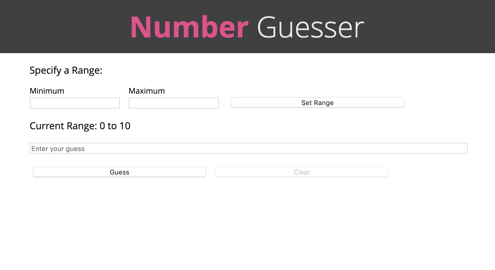

# Number Guesser

Number Guesser is a small project to introduce students to JavaScript for Module 4 Prework for the [Turing School of Software and Design](https://turing.io/). The project specification can be found [here](http://backend.turing.io/module4/intermission_work/number_guesser). 

[Here is my deployed project!](https://asmolentzov.github.io/numberguesser/)

## Features
Number Guesser allows the player to (optionally) select a range of numbers. If no range is specified, it defaults to 0-10. The player then tries to guess what number in that range the computer has selected, receiving feedback of "too high" or "too low" as needed. 

When the user correctly guesses the number, they have the option to advance to the next round, in which the range will be updated by 10 in either direction. 

## Built With
* [JavaScript](https://developer.mozilla.org/en-US/docs/Web/JavaScript)
* [jQuery](https://jquery.com/)
* HTML/CSS

## Author
**[Anna Smolentzov](https://github.com/asmolentzov)**
